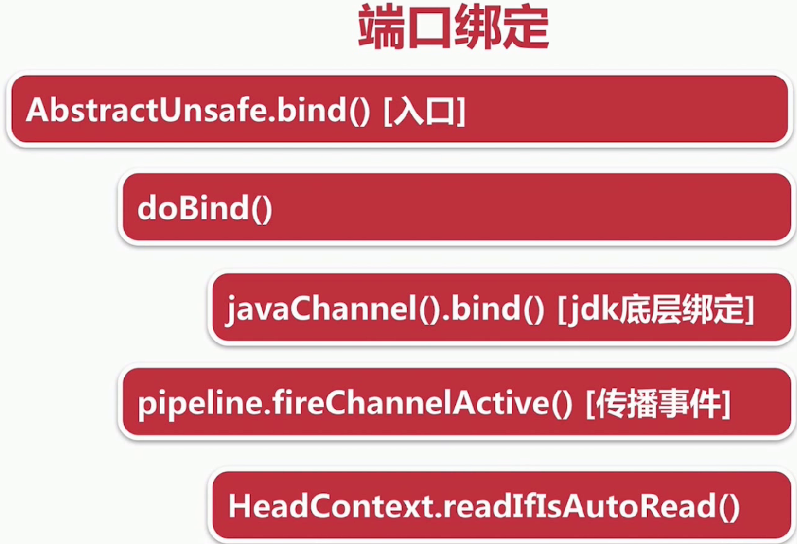

# 0.overview

**定义作用** ：

- 异步实际驱动框架，用于快速开发高性能服务端和客户端

- 封装了JDK底层BIO和NIO模型，提供高度可用的API;
- 自带编解码器解决拆包粘包问题，用户只用关心业务逻辑
- 精心设计的reactor线程模型支持高并发海量连接
- 自带各种协议栈

https://netty.io/


    实际应用：


#1. Netty 基本组件


# 2. Netty 服务端启动问题；

## 2.1 服务端的socket在哪儿初始化？

### 2.1.1 创建channel 过程；

服务端；参考ch03代码；server

```
     
       ServerBootstrap b = new ServerBootstrap();
       // channel(NioServerSocketChannel.class)  11；  
            b.group(bossGroup, workerGroup)
                    .channel(NioServerSocketChannel.class)
                    .childOption(ChannelOption.TCP_NODELAY, true)
                    .childAttr(AttributeKey.newInstance("childAttr"), "childAttrValue")
                    .handler(new ServerHandler())
                    .childHandler(new ChannelInitializer<SocketChannel>() {
                        @Override
                        public void initChannel(SocketChannel ch) {
                            ch.pipeline().addLast(new AuthHandler());
                            //..

                        }
                    });


     
     
     
     ChannelFuture f = b.bind(8888).sync();
```

```
#  io.netty.bootstrap.AbstractBootstrap;  


  public ChannelFuture bind(int inetPort) {
        return this.bind(new InetSocketAddress(inetPort));
    }
    
    
    
    
    private ChannelFuture doBind(final SocketAddress localAddress) {
        final ChannelFuture regFuture = this.initAndRegister();
        final Channel channel = regFuture.channel();
        
        
        
        
        final ChannelFuture initAndRegister() {
        Channel channel = null;

        try {
            channel = this.channelFactory.newChannel();
            this.init(channel);
        } catch (Throwable var3) {
            if (channel != null) {
                channel.unsafe().closeForcibly();
            }

            return (new DefaultChannelPromise(channel, GlobalEventExecutor.INSTANCE)).setFailure(var3);
        }
```


```
// 对应 hannel(NioServerSocketChannel.class) 11的实现；
public B channel(Class<? extends C> channelClass) {
    if (channelClass == null) {
        throw new NullPointerException("channelClass");
    } else {
     // NioServerSocketChannel类型的channelClass 通过反射方式创建；
    return this.channelFactory((io.netty.channel.ChannelFactory)(new ReflectiveChannelFactory(channelClass)));
    }
}
```


**NioServerSocketChannel **

```
public class NioServerSocketChannel extends AbstractNioMessageChannel implements 
ServerSocketChannel
```


**NioServerSocketChannel  methord**


### 2.1.2 反射创建服务端Channel过程；


#### 2.1.2.1  newSocket() 

```
//  1.  NioServerSocketChannel   默认构造函数;
    public NioServerSocketChannel() {
        this(newSocket(DEFAULT_SELECTOR_PROVIDER));
    }
    
// 2. NioServerSocketChannel newSocket 具体实现方法； 参数SelectorProvider provider；
  private static java.nio.channels.ServerSocketChannel newSocket(SelectorProvider provider) {
        try {
            return provider.openServerSocketChannel();
        } catch (IOException var2) {
            throw new ChannelException("Failed to open a server socket.", var2);
        }
    }
    
//3. 实现  java.nio.channels.spi.SelectorProvider.openServerSocketChannel 


```


####2.1.2.2 NioServerSocketChannelConfig 创建tcp参数配置类

**作用** ： 传递TCP相关的参数；


```
private final class NioServerSocketChannelConfig extends DefaultServerSocketChannelConfig {
    private NioServerSocketChannelConfig(NioServerSocketChannel channel, ServerSocket javaSocket) {
        super(channel, javaSocket);
    }

    protected void autoReadCleared() {
        NioServerSocketChannel.this.clearReadPending();
    }
}
```


####2.1.2.3  AbstractNioChannel

```
// NioServerSocketChannel 在其默认构造方法中；

public NioServerSocketChannel(java.nio.channels.ServerSocketChannel channel) {
    super((Channel)null, channel, 16);
    this.config = new NioServerSocketChannel.NioServerSocketChannelConfig(this, this.javaChannel().socket());
}
```


```
protected AbstractNioChannel(Channel parent, SelectableChannel ch, int readInterestOp) {
    super(parent);
    this.ch = ch;
    this.readInterestOp = readInterestOp;

    try {
    // 设置服务端channel非阻塞过程
    
        ch.configureBlocking(false);
    } catch (IOException var7) {
        try {
            ch.close();
        } catch (IOException var6) {
            if (logger.isWarnEnabled()) {
                logger.warn("Failed to close a partially initialized socket.", var6);
            }
        }

        throw new ChannelException("Failed to enter non-blocking mode.", var7);
    }
}
```

#### 

####2.1.2.4 AbstractChannel

 			服务端，客户端都要继承该channel;


```
io.netty.channel


protected AbstractChannel(Channel parent) {
    this.parent = parent;
    this.id = this.newId();     	 //	id changeID唯一标识；
    this.unsafe = this.newUnsafe();   // netty 特有方法；
    this.pipeline = this.newChannelPipeline(); // 和服务端客户端相关的逻辑链；
}
```


**总结**  

- newSocket 反射 创建底层jdk channel 
- 创建channel 相关的config参数类,tcp
- 然后configureBlocking（false） 设置为非阻塞模式
- 一起就绪，创建channel 最重要属性pipeline


###2.2  初始化服务端Channel

`


# 


### 2.2.1


## 2.3 注册selector


##  


```
// io.netty.channel.AbstractChannel

public final void register(EventLoop eventLoop, final ChannelPromise promise) {
    if (eventLoop == null) {
        throw new NullPointerException("eventLoop");
    } else if (AbstractChannel.this.isRegistered()) {
        promise.setFailure(new IllegalStateException("registered to an event loop already"));
    } else if (!AbstractChannel.this.isCompatible(eventLoop)) {
        promise.setFailure(new IllegalStateException("incompatible event loop type: " + eventLoop.getClass().getName()));
    } else 
    		// Step1. 绑定线程；简单的赋值操作，告诉channel所有的事件IO操作交给eventLoop 处理；
        AbstractChannel.this.eventLoop = eventLoop;
        if (eventLoop.inEventLoop()) {
         	//Step2. 实际注册；
            this.register0(promise);
        } else {
            try {
                eventLoop.execute(new Runnable() {
                    public void run() {
                        AbstractUnsafe.this.register0(promise);
                    }
                });
            } catch (Throwable var4) {
                AbstractChannel.logger.warn("Force-closing a channel whose registration task was not accepted by an event loop: {}", AbstractChannel.this, var4);
                this.closeForcibly();
                AbstractChannel.this.closeFuture.setClosed();
                this.safeSetFailure(promise, var4);
            }
        }

    }
}
```


**register0**

```
// AbstractChannel
// 跟着Step2    this.register0(promise);
private void register0(ChannelPromise promise) {
    try {
        if (!promise.setUncancellable() || !this.ensureOpen(promise)) {
            return;
        }

        boolean firstRegistration = this.neverRegistered;
        //Step2.1 调用JDK底层事件；
        AbstractChannel.this.doRegister();
        this.neverRegistered = false;
        AbstractChannel.this.registered = true;
        //Step2.2  事件回调，添加chanleHanlder到channel的时候，添加用户回调；
        AbstractChannel.this.pipeline.invokeHandlerAddedIfNeeded();
        this.safeSetSuccess(promise);
        //Step2.3 把channel注册成功这个事件，传播到用户的代码中；
        AbstractChannel.this.pipeline.fireChannelRegistered();
        if (AbstractChannel.this.isActive()) {
            if (firstRegistration) {
                AbstractChannel.this.pipeline.fireChannelActive();
            } else if (AbstractChannel.this.config().isAutoRead()) {
                this.beginRead();
            }
        }
    } catch (Throwable var3) {
        this.closeForcibly();
        AbstractChannel.this.closeFuture.setClosed();
        this.safeSetFailure(promise, var3);
    }

}
```


**AbstractChannel.this.doRegister() 紧跟上面代码Step2.1**

```
// 

protected void doRegister() throws Exception {
    boolean selected = false;

    while(true) {
        try {
           // 注册selector 调用jdk底层selector方法；
           // javaChannel 2.1所讲创建channel会创建一个jdk底层的channel;
           // 参数意义
           		1. selector
           		2. 注册时关心的事件，0，代表不关心任何时事件；
           		3.  this 代表服务端channel,通过txshahment ,绑定到selector
           
            this.selectionKey = this.javaChannel().register(this.eventLoop().selector, 0, this);
            return;
        } catch (CancelledKeyException var3) {
            if (selected) {
                throw var3;
            }

            this.eventLoop().selectNow();
            selected = true;
        }
    }
}
```

## 2.4 端口绑定；




```
// io.netty.bootstrap.AbstractBootstrap

// Step1.
private ChannelFuture doBind(final SocketAddress localAddress) {
    final ChannelFuture regFuture = this.initAndRegister();
    final Channel channel = regFuture.channel();
    if (regFuture.cause() != null) {
        return regFuture;
    } else if (regFuture.isDone()) {
        ChannelPromise promise = channel.newPromise();
        doBind0(regFuture, channel, localAddress, promise);
        return promise;
    } else {
        final AbstractBootstrap.PendingRegistrationPromise promise = new AbstractBootstrap.PendingRegistrationPromise(channel);
        regFuture.addListener(new ChannelFutureListener() {
            public void operationComplete(ChannelFuture future) throws Exception {
                Throwable cause = future.cause();
                if (cause != null) {
                    promise.setFailure(cause);
                } else {
                    promise.registered();
                    AbstractBootstrap.doBind0(regFuture, channel, localAddress, promise);
                }

            }
        });
        return promise;
、、    }
}
```


```
// io.netty.channel.AbstractChannel 方法；


public final void bind(SocketAddress localAddress, ChannelPromise promise) {
    this.assertEventLoop();
    if (promise.setUncancellable() && this.ensureOpen(promise)) {
        if (Boolean.TRUE.equals(AbstractChannel.this.config().getOption(ChannelOption.SO_BROADCAST)) && localAddress instanceof InetSocketAddress && !((InetSocketAddress)localAddress).getAddress().isAnyLocalAddress() && !PlatformDependent.isWindows() && !PlatformDependent.isRoot()) {
            AbstractChannel.logger.warn("A non-root user can't receive a broadcast packet if the socket is not bound to a wildcard address; binding to a non-wildcard address (" + localAddress + ") anyway as requested.");
        }
		// 端口绑定未完成此时返回false;
        boolean wasActive = AbstractChannel.this.isActive();

        try {
        // Step5 绑定底层JDK方法；
            AbstractChannel.this.doBind(localAddress);
        } catch (Throwable var5) {
            this.safeSetFailure(promise, var5);
            this.closeIfClosed();
            return;
        }
		// 传播事件；端口绑定之前不是active(true)，端口绑定之后是active,返回true;
		// 此时触发channelActive事件；
		// 从pipeline开始传播；
		
        if (!wasActive && AbstractChannel.this.isActive()) {
            this.invokeLater(new Runnable() {
                public void run() {
                    AbstractChannel.this.pipeline.fireChannelActive();
                }
            });
        }

        this.safeSetSuccess(promise);
    }
}
```


**紧跟上面Step5**

```
// io.netty.channel.socket.nio.NioServerSocketChannel;

protected void doBind(SocketAddress localAddress) throws Exception {
    if (PlatformDependent.javaVersion() >= 7) {
    // 创建jdk channel ，端口进行绑定；
        this.javaChannel().bind(localAddress, this.config.getBacklog());
    } else {
    // 
        this.javaChannel().socket().bind(localAddress, this.config.getBacklog());
    }

}
```

## 在哪里accept 连接？


