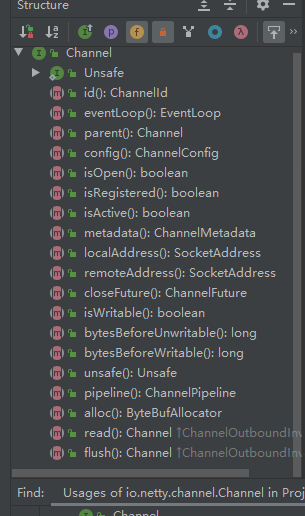
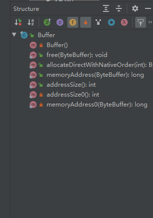

Netty


#1. Nio


## 1.1  channel

1. daigram

```
 A nexus to a network socket or a component which is capable of I/O
 operations such as read, write, connect, and bind.
```


​	  2.Structure




3. subtype of channel


## 1.2  buffer

- diagram


- subtype of buffer


- structure

  

## 1.3  selector

